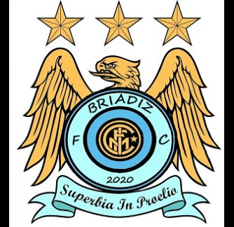

<html>
<head>
<title> Briadiz Futsal</title>

<link rel="stylesheet" type="text/css"href="estilos.css"/>
</head>

<body> 
<h1> Briadiz Futsal</h1>
<h2>Equipo de futbol sala chiclanero</h2>

 Historia:

 Briadiz Futsal es un club chiclanero de futbol sala fundado en 2010 por SR Baliña77, actualmente es presidido por Adrian Aragon. Briadiz Futsal compite en la division de honor chiclanera de futbol sala, su primer escudo como podeis ver era una copia barata de el del city que edito con el paint el vicepresidente Joaquin Cabeza y daba origen a su primer nombre manchester city, en 2021 el club paso a llamarse Briadiz Futsal y cambio por completo su escudo diseñado por el autentico gachunano
     	 

<a target ="_blank" href ="http://www.futsalchiclana.com/mod/soccer/team.aspx?itm=114055"> Equipo </a> <!--con BR saltamos al siguiente parrafo-->

<a href ="http://www.futsalchiclana.com/mod/soccer/situation.aspx?itm=11220"> Clasificación</a>

<ol>

 JUGADORES:

<li> <a href="imageness/juan.jpg">Juan (moco) </a> 
juega de ala buen manejo de ambas piernas y disparo potente pero los mejores disparos los hace en el portobello
</li>
<li> <a href="imageness/joaky.jpg">Joaquin (juakinera)</a>
 juega absolutamente de todo y aunque le duela a muchos lleva mas goles que el 60% del equipo
</li>
<li> <a href="imageness/jc.jpg">Jose Carlos (Canino)</a>
 renego del club cuando mejor estaba u  japuchazo lo aparto del equipo
 </li>
<li> <a href="imageness/foa.jpg">Alvaro (Forja)</a>
 jugador polivalente y fisico sin duda alguna el gol su telon de aquiles
 </li>
<li> <a href="imageness/adri.jpg">Adrian </a>
 Cerrojo atras su especialidad dar pases con el exterior
 </li>
<li> <a href="imageness/isma.jpg">Ismael </a>
un autentico pulmon pero tiene mas guardias que neymar en la fiesta de su cumpleaños
 </li>
</ol>

</body>
</html>

body{background:url(imageness/marleyy.jpg);}

h1{color:#F4E79F;}
h2{color:#F4E79F;}
span p {color:#F4E79F; font-size: 15px;}
	p{color:#F4E79F; font-size:20px;}
	
div a{color:#F4E79F; font-size:20px;background:#424242; padding: 5px 10px;display:inline-block;box-shadow:0px 5px 0px #F4E79F ;border-radius:50px;}
div a:hover{text-decoration:underline; background:#424242; box-shadow:0px 2px 0px #F4E79F;}

li {width:50%;background:#F4E79F; margin:5px 5px; padding:5px;border:5px solid #145A32;}

li a{color:#145A32; font-size:18px;border-radius:40px; box-shadow:5px 5px 0px #424242;}
li p {color: #A93226; font-size:14px;}
h1,h2,p,li,div,a{margin:10px 20px;}
li{border-radius:50px; box-shadow:5px 5px 0px #424242;}
li a:hover{text-decoration:underline; background:#A93226;}
img{border-radius:40px; box-shadow:5px 5px 0px #424242;}

table{border:10px solid; color: #5D4037; margin: 50px 250px;}
td h2{width:100px; height:90px; background:white;  margin:-5px;}
td h3{width:100px; height:90px; background:black; margin: -5px;}
